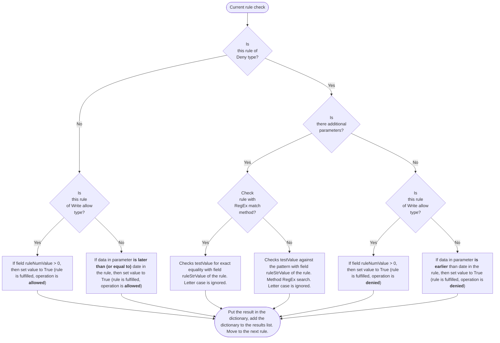
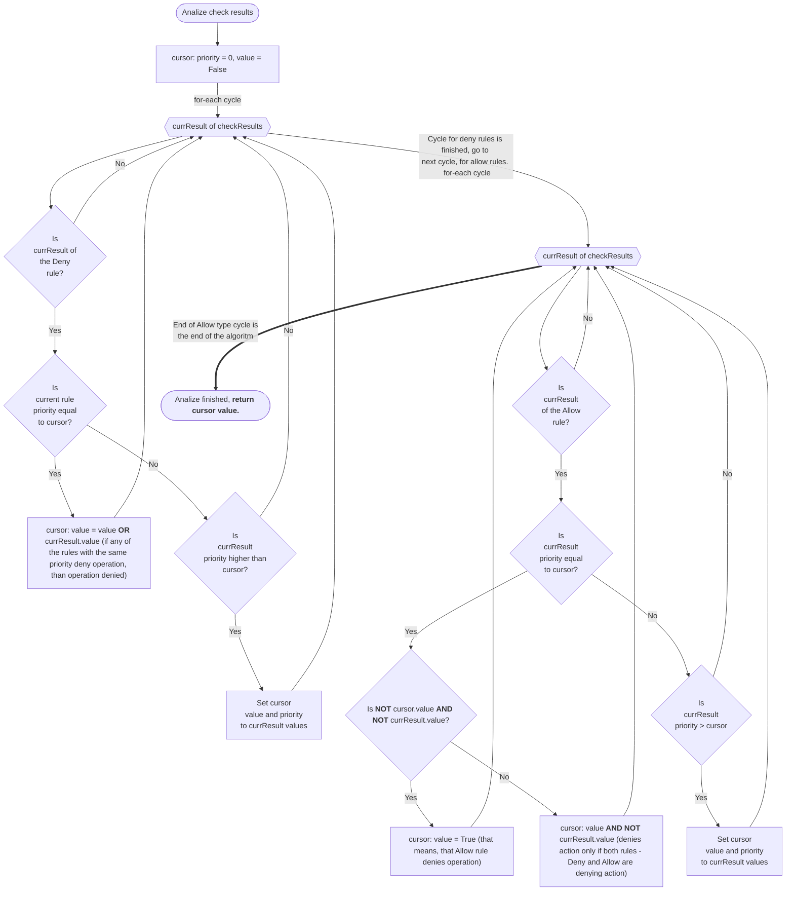

External user permissions control module for old 1C configurations

This addon processes JSON request to the Odoo server with the following data structure:
(request example can be seen at the end)

- Object type (actual dictionary values are selected by the developer)
- User name (in the external system)
- Date, associated with the object
- mode (for now it is only "write", the key is reserved for future modifications)
- additional parameters, in a dictionary

Additional parameters:
- regEx key, always True (reserved for future modifications)
- testType key, "match" or "search"
- testValue key

Rules are applied to user groups. Addon user groups do not inherit Odoo user groups, it is standalone model. Users can be included in more than one group at the same time.
Rules allow or deny access depending on the specified condition (as shown in diagram 1). Also rules have priority field, which is useful for some scenarios. Test result, priority and type of the rule are placed in the dictionary. These dictionaries, in turn, are placed in a list.
Then, analysing this list, a decision is made as to whether or not to allow access (according to diagram 2).

The return value False is considered to allow action and True is considered to deny it respectively.
Addon is experimental and in "proof-of-concept" state, so it is not recommended to use it on real databases without thorough testing.

View Mermaid-diagrams at: https://mermaid.live/
JSON request format example:

{
"jsonrpc": "2.0",
"method": "call",
"params": {
"args": [
"odoo_database_name",
user_id (here should be specific value. admin, for example, is usually 2 by default),
"passwd",
"acs1crules.usr1crules",
"extCallCheck",
[],
"DocProductsSaleOrder",
"Dennis",
"2023-06-17",
"write",
{
"regExp": true,
"testType": "match",
"testValue": "CDB00161"
}
],
"method": "execute",
"service": "object"
},
"id": null
}

Diagram 1

Diagram 2

