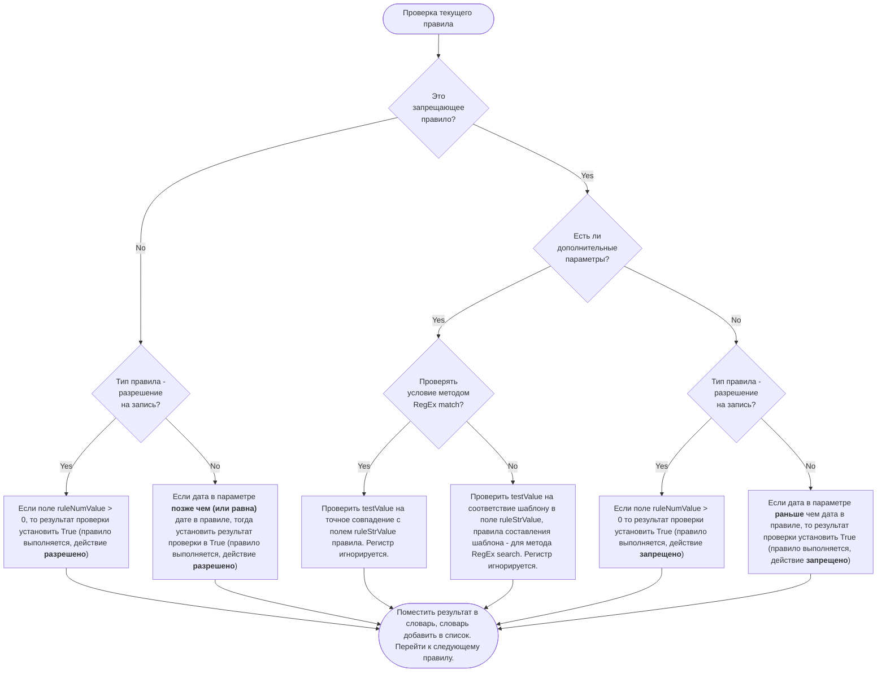
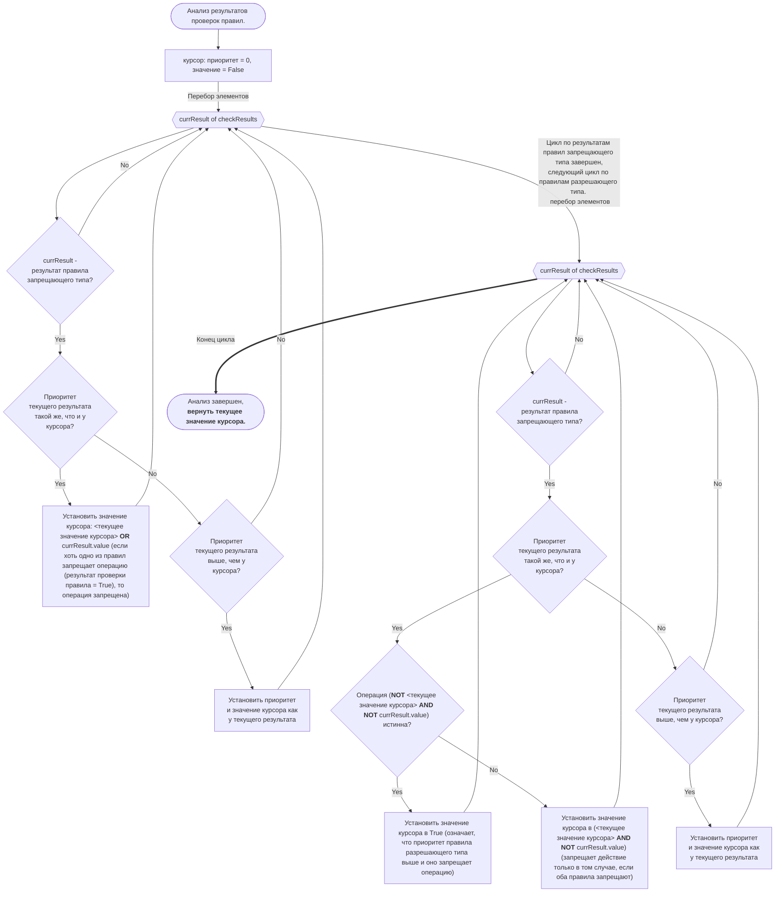

Внешний контроль прав пользователей для старых конфигураций 1С:Предприятие

Используется такая структура JSON запроса к серверу Odoo:

- Тип объекта (набор значений определяется в коде модуля)
- Имя пользователя (как в базе данных 1С)
- Дата, связанная с объектом (дата документа, произвольная дата - неважно. Дата, которая будет сравниваться)
- Режим (всегда "write", зарезервирован на будущее)
- дополнительные параметры в словаре

структура дополнительных параметров:
- regEx ключ, всегда True, зарезервирован на будущее
- testType ключ, "match" или "search"
- testValue ключ, собственно проверяемое значение

Правила применяются к группам пользователей. Группы пользователей в модуле существуют сами по себе и к группам пользователей Odoo отношения не имеют. Пользователи могут быть включены в несколько групп одновременно.

Правила запрещают или разрешают действие, как показано на Диаграмме 1. Также у правил есть приоритет, который может быть полезен в некоторых сценариях. Результат проверки правила помещается в словарь, - Приоритет, Тип правила, результат проверки. Словари, в свою очередь, помещаются в списки.
Затем, анализируя получившийся список, принимается решение, разрешить или запретить действие (в соответствии с Диаграммой 2).

Модуль является экспериментальным, поэтому, несмотря на работоспособность, для применения в рабочих базах данных не рекомендуется без предварительного широкого тестирования. Код модуля не оптимизирован ради удобства отладки.

Пример обработки для 1С - для обычных форм по понятным причинам.
Просмотр mermaid-диаграмм: https://mermaid.live/

Пример запроса JSON, формат:

{
"jsonrpc": "2.0",
"method": "call",
"params": {
"args": [
"<odoo_database_name>",
<user_id> (Здесь внутренний ID пользователя. У admin, например, 2 в чистой базе),
"<passwd>",
"acs1crules.usr1crules",
"extCallCheck",
[],
"DocProductsSaleOrder",
"Dennis",
"2023-06-17",
"write",
{
"regExp": true,
"testType": "match",
"testValue": "CDB00161"
}
],
"method": "execute",
"service": "object"
},
"id": null
}

Диаграмма 1

Диаграмма 2

